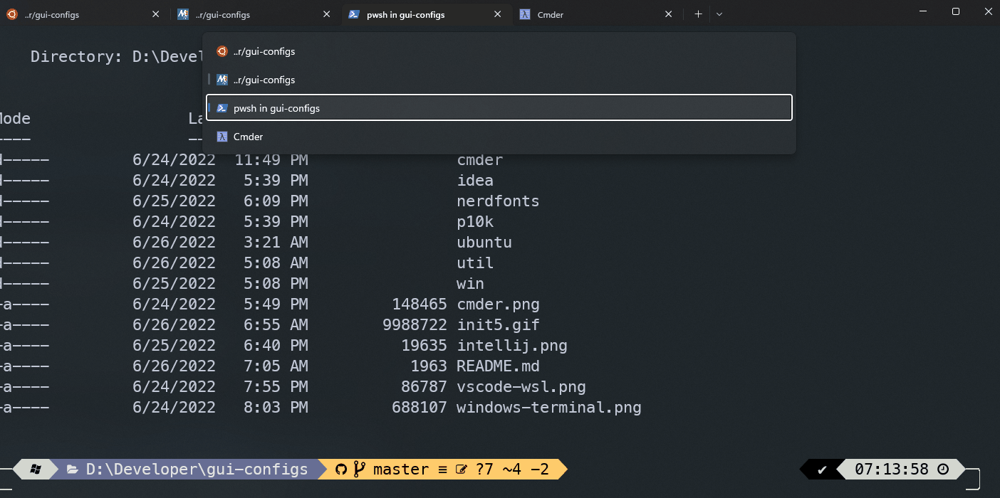
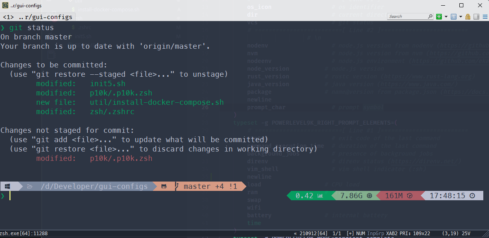
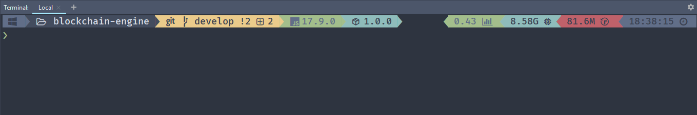
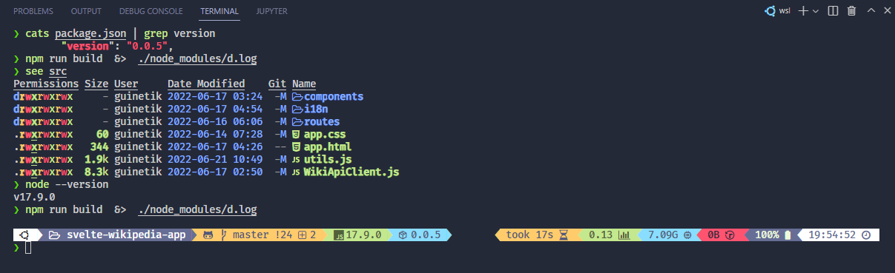
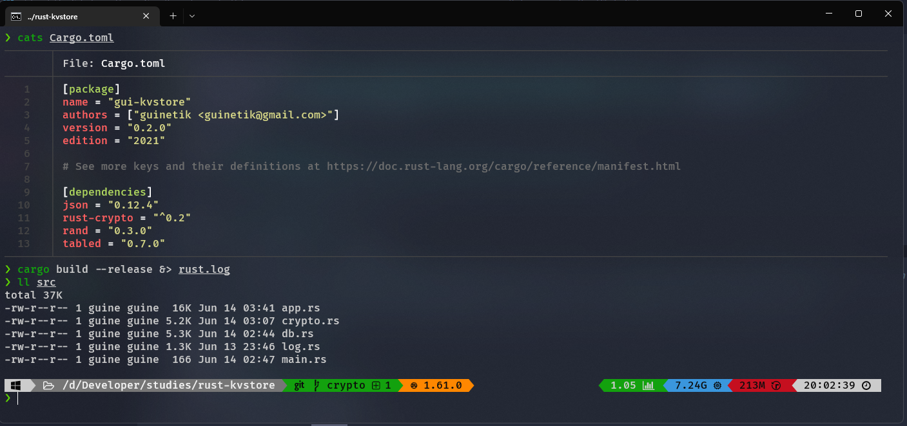

# gui-configs
My dot files and configs for the apps I use the most

# TERMINAL *SUPREMACY*!
> Running all my terminals with an as seamless as possible config:
[<center></center>](all_terminals.gif "SUPREMACY") 

## zsh ubuntu

I use the `ubuntu/init5.sh` script to boostrap a fresh machine when using linux. 

> Here is an example of init5 in action with WSL (Linux on Windows):
[<center></center>](init5.gif "init5 WSL") 

*When dealing with ubuntu/WSL, don't forget to change the files from CRLF to LF. If the scripts don't work with no reason, that's probably why.

## zsh on windows
Inspired from [This *awesome* gist](https://gist.github.com/otonii/e6bae9fabe0f19daa969f10e9047970d)

First up install mysys2

```
choco install msys2 -y
```

Then you can install zsh on mysys2's bash:

```
cmd \k .\win\install-zsh.cmd
```

This script will also install [oh-my-posh](https://ohmyposh.dev/docs/installation/windows) on powershell with my custom theme.

Then link your terminal to mysys2's bash script:

```
cmd \k .\win\run-zsh.cmd
```
you should see the default mysys2 terminal window show up.

Then we need to install zsh and the powerlevel10k theme by running `mysys2-zsh.sh`

## screenshots
> This repo viewed on ConEmu 
[<center></center>](cmder.png "This repo viewed on ConEmu")

> Intellij Terminal with Zsh running inside msys2 
[<center></center>](intellij.png "Intellij Terminal with Zsh running inside msys2") 

> VSCode Terminal with Zsh featuring a nodejs project 
[<center></center>](vscode-wsl.png "VSCode Terminal with Zsh featuring a nodejs project") 

> Windows Terminal (preview) with Zsh featuring a Rust project 
[<center></center>](windows-terminal.png "Windows Terminal (preview) with Zsh featuring a Rust project") 

## stuff used
- [zsh](https://www.zsh.org/)
- [antigen](https://github.com/zsh-users/antigen)
- [oh-my-zsh](https://ohmyz.sh/)
- [powerlevel10k](https://gist.github.com/otonii/e6bae9fabe0f19daa969f10e9047970d)
- [bash-oo-framework](https://github.com/niieani/bash-oo-framework)